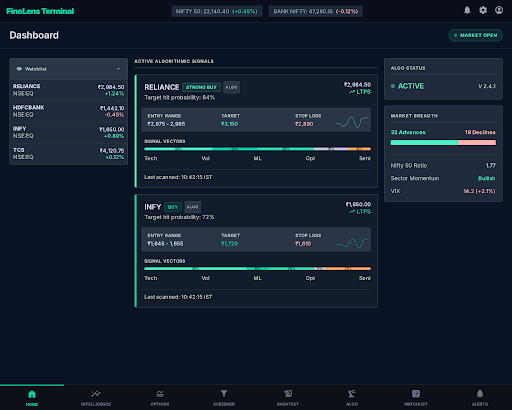
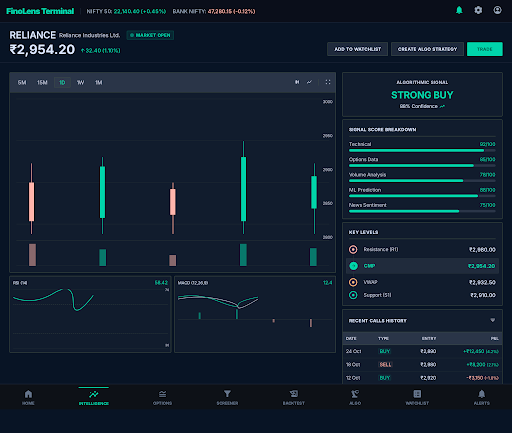
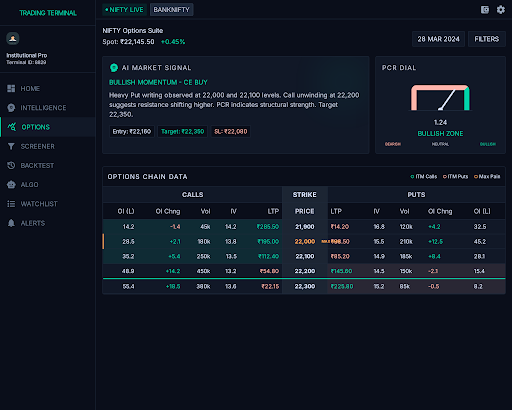
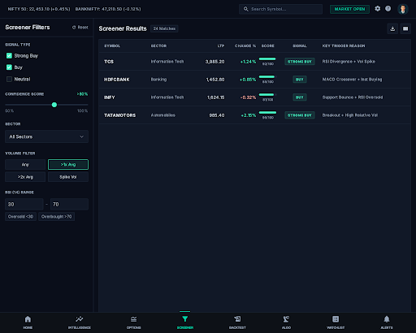
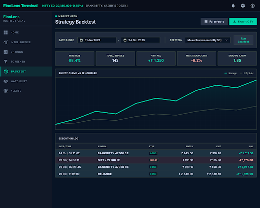
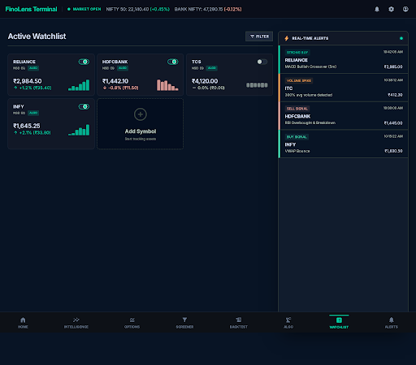
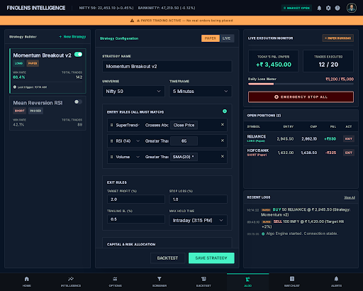

# FinoLens — Personal Stock Market Intelligence Platform

> AI-powered stock market signal generation, algo paper trading, 
> and technical analysis terminal for NSE India.
> Built for personal use. Not financial advice.

## Screenshots

### Dashboard


### Stock Detail & Intelligence


### Options Suite


### Equity Screener


### Strategy Backtest


### Watchlist & Real-time Alerts


### Algo Trading Terminal


## What is FinoLens?

FinoLens is a personal stock market intelligence platform built 
for NSE India. It generates BUY/SELL signals using a multi-factor 
scoring engine, runs paper trading strategies automatically, and 
provides a professional trading terminal UI — all running locally 
on your machine with real market data.

**This is NOT a get-rich-quick tool.** It is a serious technical 
project that applies real quantitative finance concepts:
- Multi-factor signal scoring
- Walk-forward backtesting
- Risk-adjusted position sizing
- Automated paper trading with guardrails

## Architecture

```
┌─────────────────────────────────────────────────────┐
│                   FINOLENS STACK                     │
├─────────────┬──────────────────┬────────────────────┤
│  Frontend   │     Backend      │    ML Service       │
│  React 18   │  Node.js/Express │  Python FastAPI     │
│  Vite       │  Socket.IO       │  yfinance           │
│  Port 3000  │  Port 5000       │  Port 8000          │
├─────────────┴──────────────────┴────────────────────┤
│              PostgreSQL 16 + Redis                   │
└─────────────────────────────────────────────────────┘
```

## Signal Engine

Every Nifty50 symbol is scored 0–100 every 5 minutes:

| Component | Weight | Source |
|-----------|--------|--------|
| Technical | 25% | RSI, MACD, Bollinger Bands, VWAP, EMA |
| Volume | 20% | Volume vs 20-day average |
| ML Prediction | 30% | XGBoost + feature engineering |
| Options Flow | 15% | PCR, OI buildup, Max Pain |
| Sentiment | 10% | News headline NLP |

**Score → Signal:**
| Score | Signal |
|-------|--------|
| > 72 | STRONG BUY |
| 60–72 | BUY |
| 40–60 | NEUTRAL |
| 28–40 | SELL |
| < 28 | STRONG SELL |

Each signal includes: entry price, stop loss (1–1.5%), 
target (2–3%), and confidence score.

## Pages

| Page | Description |
|------|-------------|
| Dashboard | Live Nifty50/BankNifty, active calls, market breadth |
| Intelligence | Stock detail, candlestick chart, RSI/MACD, signal breakdown |
| Options Suite | Options chain, PCR gauge, OI buildup, AI recommendation |
| Screener | Filter Nifty50 by signal, score, sector, volume, RSI |
| Backtest | Walk-forward backtest with equity curve vs benchmark |
| Algo Trading | Strategy builder, paper trading engine, live P&L |
| Watchlist | Track symbols with live quotes and sparklines |
| Alerts | Real-time Socket.IO signal alerts feed |

## Tech Stack

**Frontend:** React 18, Vite, Tailwind CSS, React Router v6,
TradingView Lightweight Charts, Recharts, Socket.IO client, Axios

**Backend:** Node.js 20, Express, Socket.IO, node-cron,
PostgreSQL (pg), Redis (ioredis)

**ML Service:** Python 3.11, FastAPI, yfinance, pandas,
numpy, ta-lib, scikit-learn, uvicorn

**Infrastructure:** PostgreSQL 16, Redis, Docker (optional)

## Quick Start

### Prerequisites
- Node.js 20+
- Python 3.11+
- PostgreSQL 16
- Redis

### 1. Clone
```bash
git clone https://github.com/Nagul-7/finolens.git
cd finolens
```

### 2. Database Setup
```bash
psql -U postgres << 'EOF'
CREATE DATABASE finolens;
CREATE USER finolens_user WITH PASSWORD 'finolens123';
GRANT ALL PRIVILEGES ON DATABASE finolens TO finolens_user;
EOF

psql -U postgres -d finolens -f database/schema.sql
psql -U postgres -d finolens -f database/seed.sql
```

### 3. Environment
```bash
cp backend/.env.example backend/.env
# Edit backend/.env with your DATABASE_URL and other values
```

### 4. Install Dependencies
```bash
cd ml-service && pip install -r requirements.txt
cd ../backend && npm install
cd ../frontend && npm install
```

### 5. Start Everything
```bash
chmod +x start.sh
./start.sh
```

Open http://localhost:3000

## Algo Trading (Paper Mode)

FinoLens includes a full paper trading engine:
- Build strategies with a visual condition builder
- Run in PAPER mode — no real orders placed
- Engine scans signals every 5 minutes during market hours
- Auto entry/exit based on your rules
- Daily loss limit guard — auto-pauses if limit hit
- Emergency Stop All button

**To go live:** Connect your Zerodha Kite Connect or 
Angel One SmartAPI credentials in backend/.env 
and set BROKER=zerodha or BROKER=angel.

## Data Sources

- **Live prices:** yfinance (NSE via Yahoo Finance)
- **Options data:** Requires broker API (Zerodha/Angel One)
- **Market hours:** 9:15 AM – 3:30 PM IST, Mon–Fri

## Disclaimer

This tool is for personal use and educational purposes only.
It is NOT SEBI registered investment advice.
Always do your own research before trading.
The author is not responsible for any financial losses.

## Author

**Nagul** — Full Stack Developer
GitHub: [@Nagul-7](https://github.com/Nagul-7)

---
*Built with React, Node.js, Python, and real market data.*
